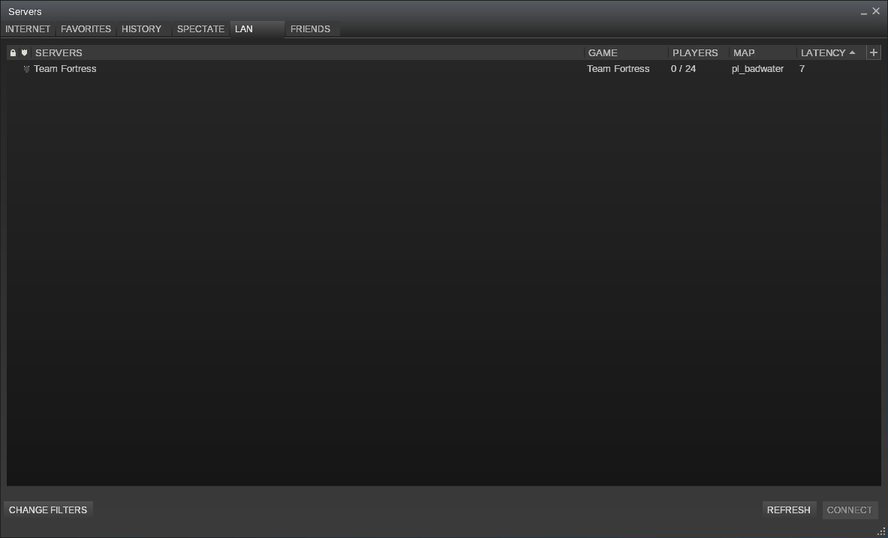

boombatower/source-server-fake
==============================
Valve's Source Engine server fake that responds to info requests. (intended for testing)

Usage
-----
To assigned the fake to a random free port use the following.
``` sh
$ docker run -dP --restart 'on-failure' boombatower/source-server-fake
```

Otherwise, a fixed port can be assigned as follows. First number is the host port which can be
changed as desired while the second number is internal container port.
``` sh
$ docker run -d -p 27015:27015/udp --restart 'on-failure' boombatower/source-server-fake
```

Result
------

LAN broadcast requests and direct server info requests will result in a fake Team Fortress 2 server.


