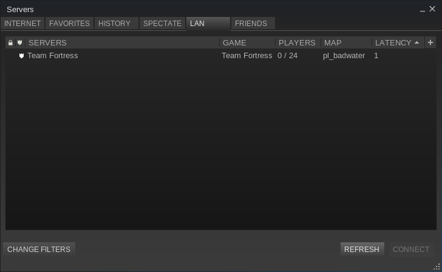

boombatower/source-server-fake
==============================
Valve's Source Engine server fake that responds to info requests. (intended for testing)

Usage
-----

``` sh
$ docker run -P boombatower/source-server-fake
```

Result
------

LAN broadcast requests and direct server info requests will result in a fake Team Fortress 2 server.


